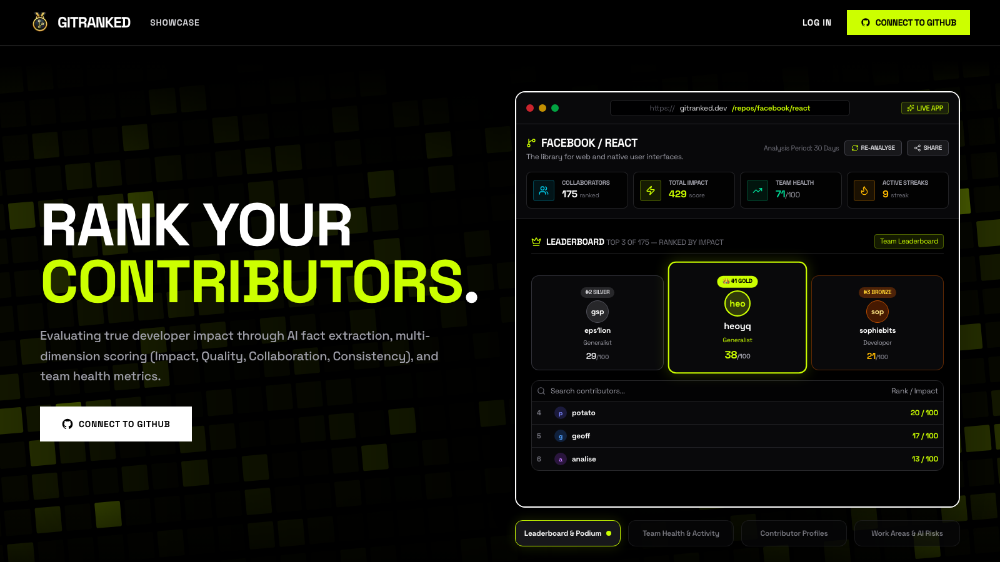

# GitRanked

**AI-powered engineering analytics for GitHub repositories.** Go beyond basic commit counts — GitRanked classifies every piece of work using AI, scores contributors across four dimensions, and surfaces actionable insights about your engineering team.

<p align="center">
  <a href="https://gitranked.dev">
    
  </a>
</p>

<p align="center">
  <a href="https://gitranked.dev"><strong>Live demo →</strong></a>
  &nbsp;·&nbsp;
  <a href="https://gitranked.dev/repos/facebook/react"><strong>Ranked real repo (facebook/react)</strong></a>
</p>


[](https://gitranked.dev)

---

## What it does

- **AI Work Classification** — Every commit, PR, review, and issue is classified into semantic work types (Feature, BugFix, Refactor, Documentation, etc.) using LLMs via OpenRouter
- **Multi-Dimensional Scoring** — Contributors are scored across **Impact**, **Quality**, **Collaboration**, and **Consistency** with both current (decay-weighted) and all-time profiles
- **Repository Health Metrics** — Delivery, Collaboration, Code Quality, Review Health, and Knowledge Distribution on a 0–100 scale
- **AI-Generated Summaries** — Repository overviews, team insights, contributor profiles, impact analyses, and weekly/monthly reports
- **Shareable Dashboards** — Token-based read-only sharing for stakeholders
- **Public Analytics Pages** — SEO-optimized landing pages for GitHub insights, PR review metrics, repository health, and more

## How it works

1. **Connect** — Install the GitRanked GitHub App on your repos, or add public repos directly
2. **Ingest** — Webhooks stream live events; historical backfill pulls the last 90 days
3. **Classify** — pg-boss workers classify raw events into work units using AI
4. **Score** — The scoring engine computes per-contributor scores with time-decay profiles
5. **Visualize** — Interactive dashboards with leaderboards, health radar charts, collaboration networks, and AI-generated reports

## Tech stack

| Layer | Technology |
|---|---|
| Frontend | Next.js 16 (App Router), React 19, Tailwind CSS v4, Framer Motion, Recharts |
| Backend | Next.js API Routes, NextAuth.js v5 (GitHub OAuth + App) |
| Database | Neon PostgreSQL (serverless) |
| Queue | pg-boss (background job processing) |
| AI | OpenRouter API — supports any LLM; defaults to free-tier models |
| Auth | GitHub OAuth App + GitHub App (installation tokens) |
| Deployment | Vercel (app) + GCP VM (worker) |

## Getting started

### Prerequisites

- Node.js 20+
- A Neon PostgreSQL database
- A GitHub OAuth App and GitHub App
- An OpenRouter API key (free tier works)

### Environment variables

```bash
# Database
DATABASE_URL=postgresql://...

# GitHub OAuth App
GITHUB_CLIENT_ID=...
GITHUB_CLIENT_SECRET=...
AUTH_GITHUB_ID=...      # same as GITHUB_CLIENT_ID
AUTH_GITHUB_SECRET=...  # same as GITHUB_CLIENT_SECRET

# GitHub App
GITHUB_APP_ID=...
GITHUB_PRIVATE_KEY=...  # PEM-encoded private key
GITHUB_WEBHOOK_SECRET=...

# OpenRouter AI
OPENROUTER_API_KEY=sk-or-v1-...
OPENROUTER_MODEL=nvidia/nemotron-3-super-120b-a12b:free

# NextAuth
AUTH_SECRET=...         # generate with: openssl rand -hex 32
AUTH_URL=http://localhost:3000

# App
NEXT_PUBLIC_APP_URL=http://localhost:3000
NEXT_PUBLIC_GITHUB_APP_SLUG=your-app-slug
```

### Development

```bash
npm install
npm run dev        # starts on http://localhost:3000
npm run worker     # starts pg-boss worker (in a separate terminal)
```

### Database

```bash
npm run db:migrate  # runs schema migration
```

### Testing

```bash
npm run test        # vitest
npm run typecheck   # tsc --noEmit
npm run lint        # eslint
```

## Architecture

```
GitHub Events (webhooks / backfill)
        │
        ▼
   API Routes ────► Neon PostgreSQL
        │
        ▼
   pg-boss Queue ─► Worker (classification)
        │
        ▼
   OpenRouter AI ──► Work Units + Scores
        │
        ▼
   Dashboard / APIs / Shared Links
```

## License

MIT
